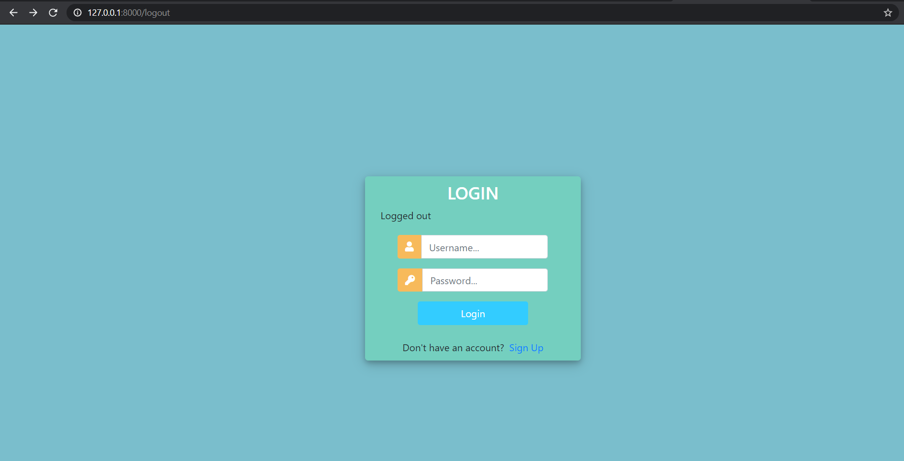
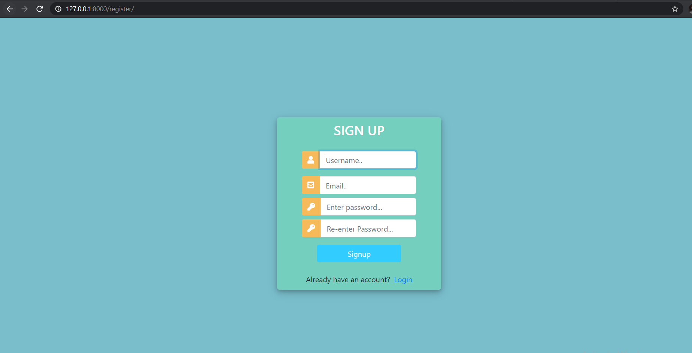
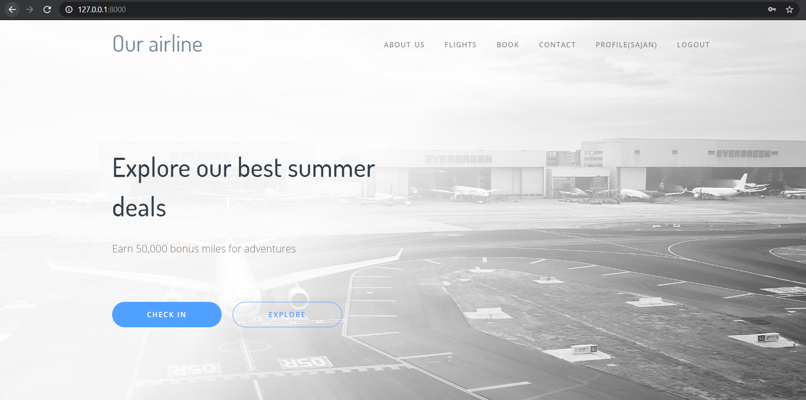
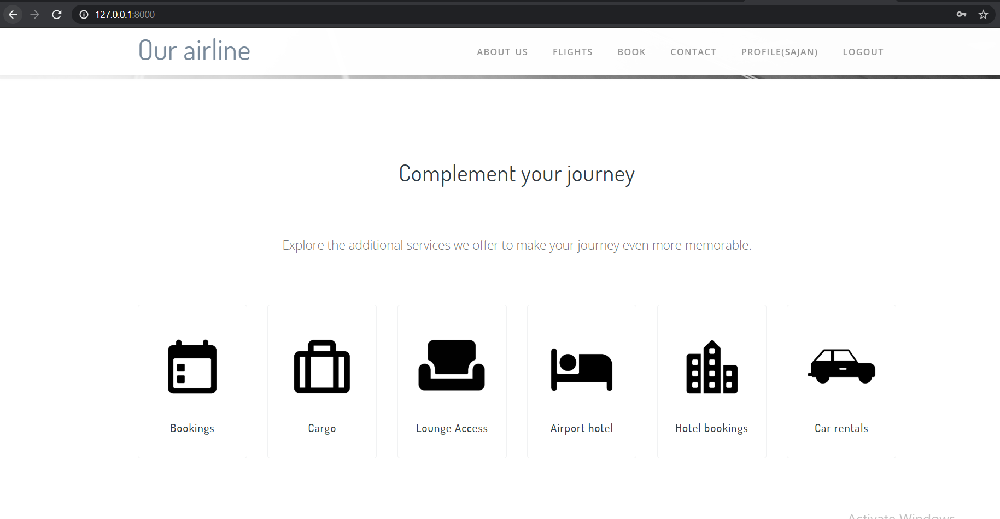
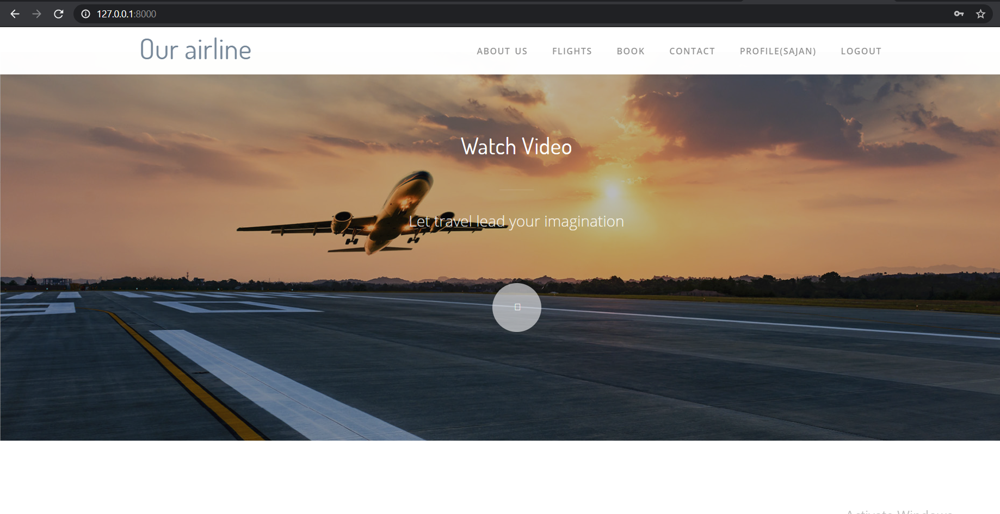
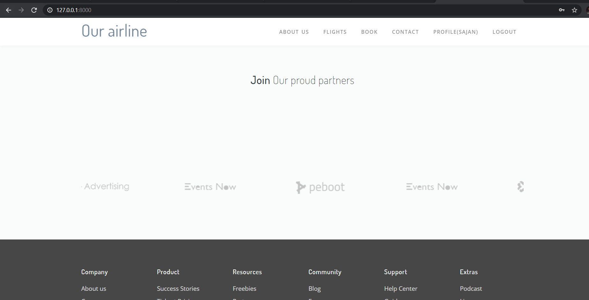
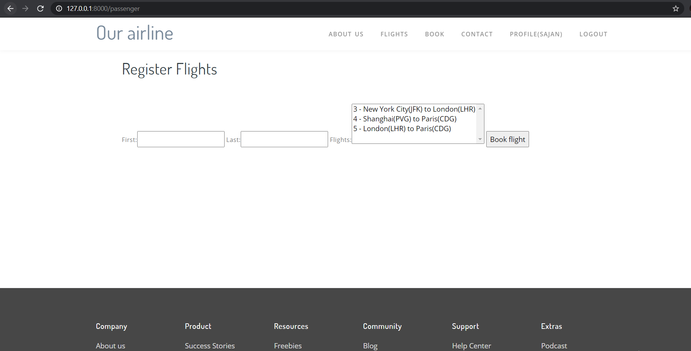
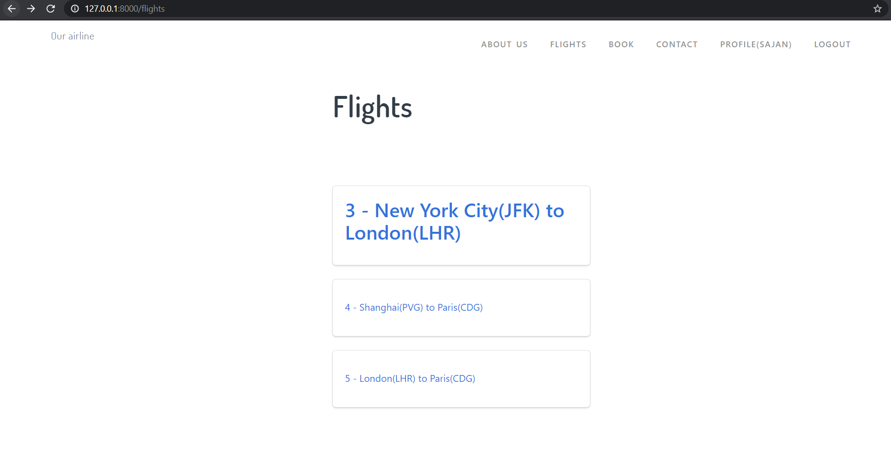
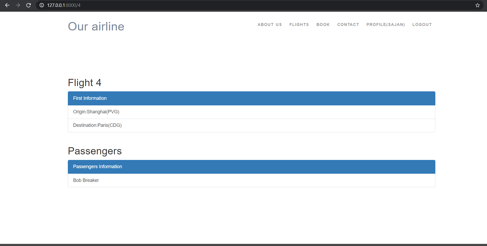

# Book_myflight

A Django web app for a airline company to manage their flights let customers signup,book flight,inquiry about flights, contact.

# Packages
- django
- psycog2
- psycopg2 

## Setting up the project
-Use pipenv for virtual environment \
`pipenv install --dev`\
-If virtual enviroment is already activated\
`pipenv sync         `\
-Or\
`pipenv sync --dev   `

## login

## landing page

## Booking

## flights

## contact

